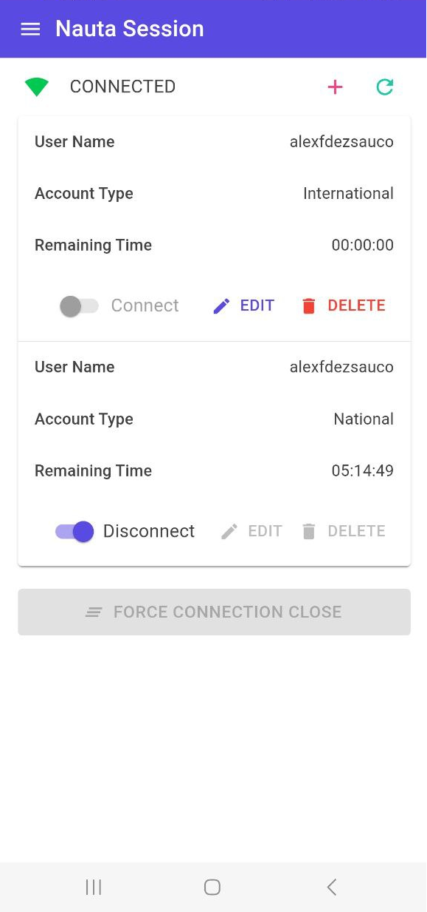

Nothing.Nauta
===============

The ultimate dotnet API to manage ETECSA nauta sessions

Build Status
------------

Branch | Status
------ | :------:
master | 
develop | 

# Contributions

This is an open-source project, so your contributions are welcome. You can get in touch by:

- Creating tickets.
- Contributing by pull requests.
- or just [buying me a coffee](https://qvapay.com/payme/alexander.fernandez.sauco) :wink:

# Nothing.Nauta Example Applications

## Nauta Session CLI

`nauta-session` is command line tool to manage ETECSA nauta sessions built on top `Nothing.Nauta`.

### Install 

1) Download the latest version from the [releases](https://github.com/alexfdezsauco/Nothing.Nauta/releases) page depending on your operating system.  

2) Add the `nauta-session` executable file to your system path. 

> If you select a `non-self-contained` assets you must install the [dotnet runtime](https://dotnet.microsoft.com/en-us/download/dotnet/6.0/runtime) first.

### Usage

  nauta-session [command] [options]
  
### Commands

#### Save Credentials

To save credentials use the `credentials` command as follow:

    > nauta-session credentials --username %USERNAME% --password %PASSWORD%

Actually, it is also possible save multiple credentials with alias: 

    > nauta-session credentials --username %USERNAME% --password %PASSWORD% --alias %ALIAS%

    
#### Open Nauta Session

To open a nauta session use the `open` command as follow:

    > nauta-session open

In order to open a session with credentials saved with an alias you could use a command as follow:

    > nauta-session open --alias %ALIAS%

#### Query Remaining Time From Nauta Session

To query remaining time from the nauta session use the `time` command as follow:

    > nauta-session time
    
#### Close Nauta Session

To close a nauta session use the `close` command as follow:

    > nauta-session close

## Nauta Session App

`nauta-session-app` is an application to manage ETECSA nauta sessions built on top `Nothing.Nauta`.

### Install

1) Download the latest version from the [releases](https://github.com/alexfdezsauco/Nothing.Nauta/releases) page depending on your operating system. 

> The app is not ready to be published in official stores like [Google Play Store](https://play.google.com/), [Apple Store](https://www.apple.com/store), but it will be available soon.